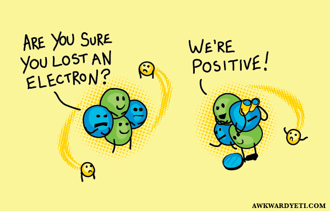

<!-- Start The Scientific Method -->
You may have walked across a carpeted floor to pet your dog and gotten a shock. You may have taken off your winter hat and found that your hair was standing straight up in the air. Those things happen because of static electricity. 

To understand static electricity, you have to understand atoms. Everything around us is made up of very small things called atoms. Those atoms are made up of even smaller things, including protons and electrons. Protons have a positive charge, and electrons have a negative charge. Each atom usually has the same number of protons and electrons, but if two atoms bump into each other, electrons from one atom can get rubbed off onto the other atom. 

As you walk across a carpeted floor (especially if you drag your feet), extra electrons build up on your body. When you touch your dog, those electrons jump onto the dog, causing a little spark of static electricity. 

Why does your hair stand up when you pull off your winter hat? That happens because all your individual hairs now have a positive charge and are repelling each other. (This is like trying to hold the positive sides of two magnets together.)

Static electricity also makes some things stick together, such as hiking socks and dryer sheets.

*From the Super Science adventure in the Bear Cub Scout Handbook (p. 272).*

# The Scientific Method
Scientists try to create a fair test when they want to answer a question using the *scientific method*.

The scientific method is a series of steps used by scientists to determine whether something they think (knwon as a "hypothesis") is valid or not. It can also be used to solve everyday problems in any topic or area.

There are 6-steps in the scientific method.

1. **Ask a question** - Ask yourself "what do I want to learn more about?", or "I wonder what would happen if...?"
2. **Hypothesize** - Do some research to make an educated guess (or hypothesis) about what you think the answer to your question is.
3. **Experiment** - Test your hypothesis by doing an experiment. 
4. **Observe & record** - During your experiment, make careful observations and write down what happens.
5. **Analyze** - Use the information you collected to draw conclusions about your experiment. Was your hypothesis correct?
6. **Share results** - Explain your results by presenting your experiment, observations, and conclusions. 

# Science Time
Its time to put science to the test (that's funny because all science is tests). For this science experiment you will create hypotheses about whether or not objects will stick to an electrically charged balloon or comb. 

## Supplies
- A latex balloon or plastic comb
- Fleece blanket or wool sweather (or your head of hair)
- Tissue paper
- Aluminum foil
- Cardboard scrap
- Paper scrap
- Yarn or string
- Ribbon
- Cloth
- Foam
- Coin

## 1. Ask a Question
Think about what we are trying to figure out. What are the questions you are trying to answer? One question could be, "will tissue paper cling to an electrically charged ballon?"

What other questions could you ask?

## 2. Hypothesize
Once you have one or more questions that you can answer with an experiment (for example, will tissue paper cling to an electrically charged ballon?), you should create a hypothesis - that is a prediction of what you *think* will happen. 

## 3. Experiment
Now it is time to experiment. Follow the steps below to run at least three experiements - be sure to take good notes. 

1. Blow up a balloon or take a comb and rub each of them separately against a fleece blanket, wool sweater or your hair.
2. One at a time, hold the test objects close to the ballon or comb to see if it clings or falls away.

## 4. Observe & Record
Observations are critical to science. Make sure during the experiments that you watch what is happening and take notes of your observations. 

| Object                           | Prediction    | Observations |
| -------------------------------- |:-------------:|:------------:|
| Example             |Write your prediction here. |Write your observations from the experiment here.               |
| Tissue paper    |               |              |
| Aluminum foil   |               |              |
| Cardboard scrap |               |              |
| Paper scrap     |               |              |
| Yarn or string  |               |              |
| Ribbon          |               |              |
| CLoth           |               |              |
| Foam            |               |              |
| Coin            |               |              |
&nbsp;

## 5. Analyze
After you run the experiment, look over your notes and see if you can make a conclusion (that's a fancy way to say 'describe the science you observed').

## 6. Share Results
Share your hypothesis, experiments, observations and conclusion with your Supernova Mentor.

# Another Experiment You Can Do
Have you ever wondered if an egg will sink or float? Do you think adding anything to the water would change the outcome? Let's find out! For this science experiment you will create hypotheses about whether or not objects will sink or float in different solvents.

## Supplies
- Three large cups (at least 12-ounces) all the same size
- Three fresh eggs about the same size
- Two (2) tablespoons of salt
- Two (2) tablespoons of sugar
- Water
- A spoon

## 1. Ask a Question
Think about what we are trying to figure out. What are the questions you are trying to answer? One question is, "does an egg float in water?" Another question is, "does adding salt to the water change whether the egg floats or sinks?" A third question is, "does adding sugar to the water change whether the egg floats or sinks?"

What other questions could you ask?

## 2. Hypothesize
Once you have one or more questions that you can answer with an experiment (for example, does an egg float in waater mixed with sugar?), you should create a hypothesis - that is a prediction of what you *think* will happen. 

## 3. Experiment
Now it is time to experiment. Follow the steps below to run at least three experiements, one for each egg - be sure to take good notes. 

1. Fill each cup halfway with water.
2. Add the salt to the second cup, and stir.
3. Add the surag to the third cup, and stir.
4. Slowly add an egg to each cup and write down your observations.

## 4. Observe & Record
Observations are critical to science. Make sure during the experiments that you watch what is happening and take notes of your observations. 

| Cup                              | Prediction    | Observations |
| -------------------------------- |:-------------:|:------------:|
| Example             |Write your prediction here - sink, float or something else... |Write your observations from the experiment here.               |
| Cup&nbsp;1&nbsp;Water&nbsp;Only  |               |              |
| Cup&nbsp;2&nbsp;Salt&nbsp;Added  |               |              |
| Cup&nbsp;3&nbsp;Sugar&nbsp;Added |               |              |
&nbsp;

## 5. Analyze
After you run the experiment, look over your notes and see if you can make a conclusion (that's a fancy way to say 'describe the science you observed').

## 6. Share Results
Share your hypothesis, experiments, observations and conclusion with your Supernova Mentor.